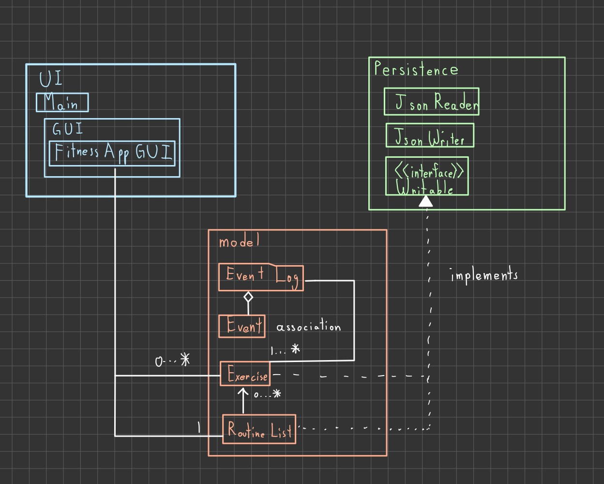

# Exercise + Diet Planner

## *Project Description*

**What will the application do?**   
This application will allow the user to make their own workout routine and diet plan, whilst returning total calories burnt, total calories gained and also the components of the food they consume e.g. protein amount etc. The user will be able to see the amount of exercises they added and the amount of food sthey eat. They will aslo be able to remove or and add exercise and food

**Who will use it?**  
People who exercise regularly and want to record their exercises and diets easily.  

**Why is this project of interest to you?**  
This project is interesting to me because I exercise regularly and I am familiar with the needs and structure of workout+diet planning. Furthermore I am itnerested in makign a project of this type that is tailored to everyones needs. 

## *User Stories*

- As a user I want to be able to add an exercise to my Exercise Plan and specify name,duration , calories burnt, number of reps performed e
- As a user I want to view the amount of Exercises to my Exercise Plan
- As a user I want to view a list of names of Exercises in my exercise plan
- As a user, I want to be able to mark an exercise as completed in my Exercise Plan
- As a user, I want to be able to remove a Exercise from my Exercise Plan
- As a user, I wat to edit an exercise within a Routine List

- As a user, I want to be able to save my Routine list to file (if I so choose)
- As a user, I want to be able to be able to load my Routine List from file (if I so choose)
- As a user, when I select the quit option from the application menu, I want to be reminded to save my changes list to file and have the option to do so or not.
- As a user, when I start the application, I want to be given the option to load my Routine list from file.

UML Diagram

Phase 4: Task 3
The design of the application appears well-structured, but there are a few areas where refactoring could enhance 
maintainability and flexibility. One potential improvement is the introduction of an interface or abstract class for the
classes involved in file I/O operations (specifically JsonWriter and JsonReader). This way, the code could be adapted 
more easily to support different file formats or sources in the future. Furthermore, I think that for the FitnessApp, it
demonstrates a separation of concerns, encapsulating user interface logic while interacting seamlessly with the 
underlying model components. However we could implement robust input validation to insure that the user inputs for 
repetitions, durationa dn calories are valid numeric values rather than doing them individually, even tho we have a 
central method called checkinputint etc. Furthermore, we can refactor the conditional locks in the fitnessAppgui such as
block checking if newName is empty or already exists could be a separate method for organization nd readability.
